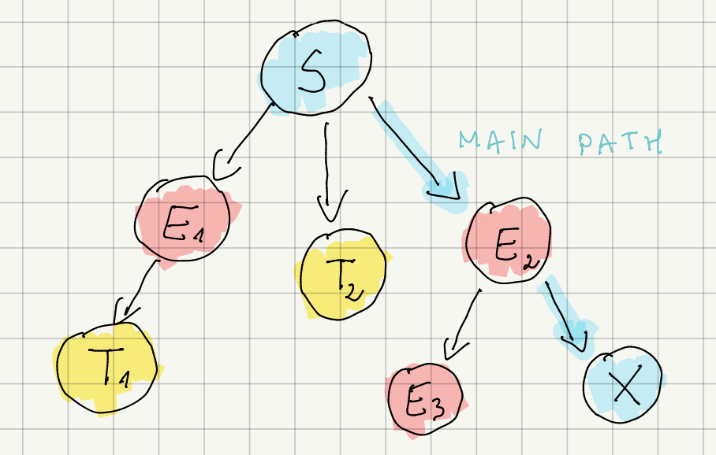
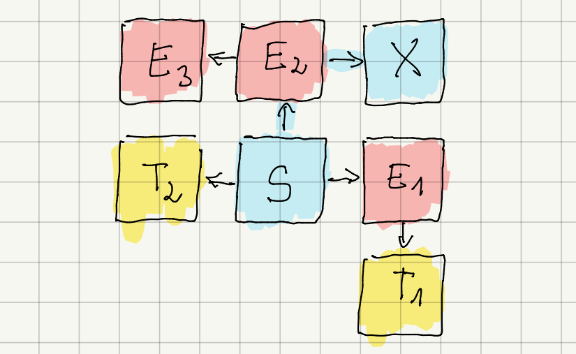
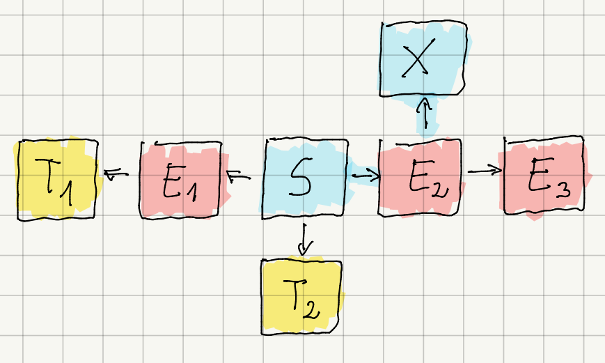
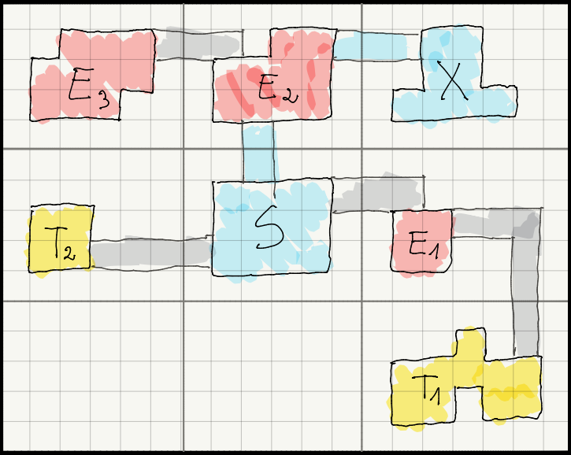

# Procedural Content Generation of Dungeons in Roguelike Games

## Overview and Goals

Creating compelling levels in roguelike games is challenging, as they need to be:
- **Diverse** — similar to random-based approaches (BSP, agent-based generation)
- **Controllable and high-quality** — similar to evolutionary or quality-diversity-based approaches
- **Fast to generate** — similar to constructive approaches (grammar-based generation)

This project implements a hybrid procedural generation algorithm that addresses all these requirements 
by combining MAP-Elites tree creation with rule-based grid mapping.

## Hybrid Algorithm

The primary goal is to generate diverse levels quickly. The approach splits generation into two phases:
1. **Tree structure generation** — creating the level's narrative "story"
2. **Grid mapping** — translating the tree onto a playable grid

Tree structures are generated offline using the MAP-Elites algorithm, with results saved to files. This eliminates the time-consuming MAP-Elites computation during gameplay. At runtime, trees are mapped onto grids using a fast combination of backtracking and grammar-based generation.

### Step 1: Generating Tree Structure

In the first step, we generate tree structures using the MAP-Elites algorithm and save them to the `/levels` directory. These trees should be understood as "player stories" rather than grid layouts. Each node represents an action or experience available to the player.

<figure>
  
  <figcaption><em>Figure 1: Example tree structure</em></figcaption>
</figure>

In this example, the player starts at `S` (start) and must reach `X` (exit). However, the player has multiple options:

- Fight enemies in `E1` (enemy room 1) to access treasure `T1` (treasure room 1), then return to `S` and progress
- Collect loot from `T2` (treasure room 2), then return to `S` and progress
- Collect both treasures from `T1` and `T2` before advancing
- Skip both treasures and proceed directly to `E2` (enemy room 2), then to `X` (exit)
- From `E2`, optionally fight enemies in `E3` (enemy room 3) before reaching `X`

Each time the game is played, a tree from the `/levels` directory is selected (randomly or based on specific criteria) and mapped onto a layout.

### Step 2: Layout Generation

In the second step, the selected tree is mapped onto a layout. A layout is an intermediate representation of the level, consisting of rooms as single grid cells and corridors as connections to parent rooms.

Importantly, a single tree can generate multiple distinct layouts:

<figure>
  
  <figcaption><em>Figure 2: First layout generated from the tree in Figure 1</em></figcaption>
</figure>

<figure>
  
  <figcaption><em>Figure 3: Alternative layout generated from the tree in Figure 1</em></figcaption>
</figure>

Layout generation uses a randomized backtracking algorithm that places rooms on the grid sequentially, starting from the tree's root. MAP-Elites trees are designed to always be easily mappable onto a grid.

### Step 3: Grid Mapping

The final step transforms the layout into a complete grid representation. Based on the trimmed layout (containing only rooms and corridors with margins removed), the grid space is partitioned to allocate equal space to each node. Each room is then generated using grammar-based rules, enabling varied room shapes and diverse placements of enemies and treasures.

<figure>
  
  <figcaption><em>Figure 4: Grid generated from the layout in Figure 2</em></figcaption>
</figure>

## Potential Applications

After testing this algorithm on the CodinGame platform, the next step is to explore its integration into a standalone game. 
Roguelike games are ideal for procedural generation, as they typically require numerous sequential levels. Additionally, 
procedural generation enhances replayability by ensuring each run offers a unique experience.

**Example scenario:** With 100 MAP-Elites trees saved across files and a game structure requiring 5 progressively harder 
dungeons per run, approximately 20 trees can be allocated per difficulty level. 
Each tree can then be mapped to a grid with added randomness. This approach ensures high probability of unique 
runs — statistically, about 80% of levels will have a different parent tree compared to the previous session.

## Statistics and Results

Detailed statistics and analysis can be found in the [results notebook](results.ipynb).
